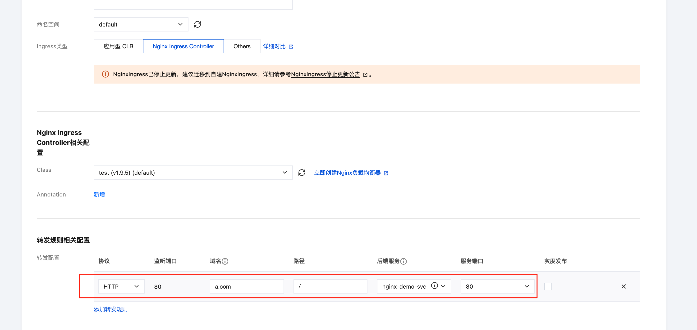

# 从 TKE Nginx Ingress 插件迁移到自建 Nginx Ingress

## 背景
TKE Nginx Ingress 扩展组件已不再支持 TKE 1.30 及以上版本。若需升级集群版本至 1.30 或更高，需移除低版本集群中的 Nginx Ingress 扩展组件，并切换至社区版 Nginx Ingress。

本文档针对此场景，整理了已验证的操作步骤，帮助用户在复用现有 IngressClass 和 Service 的前提下，顺利完成 Nginx Ingress 的切换与升级。

## 切换升级思路

### 方案一（推荐）
官方推荐的最稳健方式：在同一集群内分别部署新旧两个版本的 Nginx Ingress 控制器。两个版本独立运行（包括独立的 IngressClass、Service 和 Pod 等资源）。切换时通过修改域名解析至新入口地址，实现平滑迁移。

### 方案二（不推荐）
直接滚动升级 Nginx Ingress Controller 的镜像版本。此方式操作简单，但依赖环境兼容性，尤其是跨高版本升级可能引入未预期的变更，现网切换风险较高。

### 方案三（非标方案）
使用社区版 Nginx Ingress Helm Chart 安装新版控制器，沿用旧版本的 IngressClass（如 `tke-nginx` 或自定义类名），并直接关联旧版本业务 Service 的端口和选择器。新旧控制器并行运行，通过负载均衡器或 DNS 按比例分发流量，观察业务稳定性（如错误率、响应延迟）。确认新版稳定后，删除旧版控制器相关资源。

### 本文基于推荐方案进行测试

### 先部署 Nginx 的 Demo，并利用 TKE Nginx Ingress 启动，后续完成多方案迁移

#### 第一步：新增 Nginx Ingress


#### 第二步：进入集群验证 Nginx Ingress 是否创建
```bash
kubectl get ingressclass
```


```bash
kubectl get svc
```


#### 第三步：创建 Demo

1. 创建 `nginx-demo`
```yaml
# nginx-deploy-svc.yaml
apiVersion: apps/v1
kind: Deployment
metadata:
  name: nginx-demo
spec:
  replicas: 2
  selector:
    matchLabels:
      app: nginx-demo
  template:
    metadata:
      labels:
        app: nginx-demo
    spec:
      containers:
      - name: nginx
        image: nginx:1.25-alpine
        ports:
        - containerPort: 80
---
apiVersion: v1
kind: Service
metadata:
  name: nginx-demo-svc
spec:
  selector:
    app: nginx-demo
  ports:
  - port: 80
    targetPort: 80
  type: ClusterIP
```

```bash
kubectl apply -f nginx-deploy-svc.yaml
```


2. 将 `nginx-demo-svc` 挂载到 TKE 旧插件的 IngressClass `test`



3. 使用 `curl` 测试


### 升级切换

#### 前置条件
1. 下载官方 Helm Chart 包
```bash
curl https://raw.githubusercontent.com/helm/helm/main/scripts/get-helm-3 | bash
```

```bash
# 添加官方仓库
helm repo add ingress-nginx https://kubernetes.github.io/ingress-nginx
```

#### 方案一：
1. 确认已安装的 Nginx Ingress 相关信息
   1.1 确认已安装的 Nginx Ingress 实例的 IngressClass 名称
```bash
kubectl get deploy -A | grep nginx
dufauklt   test-ingress-nginx-controller-7d747fdcff-792mm           1/1     Running   0               82m
```
在本例中，实例的 Deployment 名称为 `test-ingress-nginx-controller`，IngressClass 为 `test`。

   1.2 确认当前使用的 Nginx Ingress 镜像版本
```bash
kubectl get deploy test-ingress-nginx-controller -o yaml | grep image:
image: ccr.ccs.tencentyun.com/tkeimages/nginx-ingress-controller:v1.9.5
```
本例中的镜像版本为 `v1.9.5`。

2. 确认当前使用的 Chart 版本
```bash
helm search repo ingress-nginx/ingress-nginx --versions | grep 1.9.5
ingress-nginx/ingress-nginx     4.9.0           1.9.5           Ingress controller for Kubernetes using NGINX a...
```
本例中 Chart 版本为 `4.9.0`，后续安装新版时需指定此版本。

3. 配置 `values.yaml`
确保新创建的 Nginx Ingress 实例不与 TKE 插件创建的实例共用同一个 IngressClass。
```yaml
# vim values.yaml
controller:
  ingressClass: new-test # 新 IngressClass 名称，避免冲突
  ingressClassResource:
    name: new-test
    enabled: true
    controllerValue: k8s.io/new-test
```

4. 安装新的 Nginx Ingress Controller
```bash
helm upgrade --install new-test-ingress-nginx ingress-nginx/ingress-nginx \
  --namespace ingress-nginx --create-namespace \
  --version 4.9.0 \
  -f values.yaml
```

5. 获取新 Nginx Ingress 的流量入口
```bash
kubectl -n ingress-nginx get svc
```

`EXTERNAL-IP` 为新的流量入口，后续验证转发是否正常。

6. 持续访问 `a.com`，确保流量迁移无中断
```bash
while true; do date '+%F %T'; curl -s -o /dev/null -w '%{http_code} %{time_total}\n' a.com; sleep 1; done
```


7. 复制 Ingress 配置文件资源
将使用旧 IngressClass 的 Ingress 资源 YAML 文件保存并修改名称（如添加前缀 `new-`），然后应用到集群中。确保新旧 Nginx Ingress 实例的转发规则一致。


8. 观察长 Ping 是否中断


9. 删除原 `test` 的 Ingress


10. 观察长 Ping


11. 删除旧 Nginx Ingress 实例


至此，迁移 Demo 实例已完成。