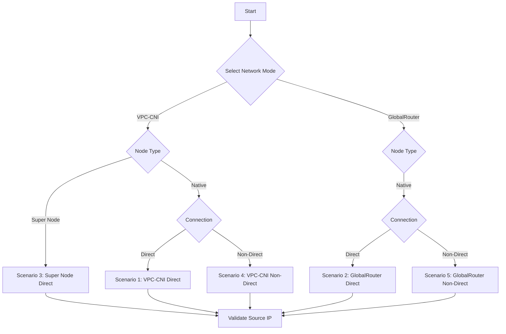

##  TKE Real Client IP Preservation Guide
[English](README.md) | [中文](README_zh.md)
#### **Background & Necessity: Solving Critical Pain Points in Cloud-Native Environments**​

In Tencent Kubernetes Engine (TKE), ​**preserving the client’s real source IP**​ is essential for security auditing, access control, logging, and analytics. However, the default Kubernetes networking model replaces the source IP with the node IP.

For example:
- In non-direct mode, traffic forwarded via NodePort loses the source IP.
-  In direct mode, misconfigurations prevent CLB (Cloud Load Balancer) from reaching Pods directly.

This project provides ​**five standardized solutions**​ covering both TKE networking modes and node types, enabling zero-code modification for real client IP preservation.

### **Core Value**

**1. Enterprise-Grade Security Compliance**​

- **Regulatory Adherence**: Meets traceability requirements for finance, government, and regulated industries.
- **Zero-Trust Foundation**: Enables dynamic authorization and DDoS mitigation based on real IPs.
- **Precise Traffic Control**: Supports canary releases and geo-restrictions.

**2. Performance & Cost Optimization**​

|​**Mode**​|​**Advantage**​|​**UseCase**​|
|:-:|:-:|:-:|
|​**Direct Pod**​|Eliminates NodePort, reduces latency|High-frequency trading, real-time risk control|
|​**Non-Direct Pod**​|Legacy compatibility, no refactoring|Traditional service migration|


### 🧩 ​**Five Scenario Comparison**​


|​**Scenario**​|​**NetworkMode**​|​**Connection**​|​**NodeType**​|​**KeyFeature**​|
|:-:|:-:|:-:|:-:|:-:|
|​**Scenario 1**​|VPC-CNI|Direct|Native|`service.cloud.tencent.com/direct-access: "true"`|
|​**Scenario 2**​|GlobalRouter|Direct|Native|`GlobalRouteDirectAccess="true"` + `direct-access: "true"`|
|​**Scenario 3**​|VPC-CNI|Direct|Super Node|Native support|
|​**Scenario 4**​|VPC-CNI|Non-Direct|Native|`type: NodePort` + `kubernetes.io/ingress.class: qcloud`|
|​**Scenario 5**​|GlobalRouter|Non-Direct|Native|`type: NodePort` + `kubernetes.io/ingress.class: qcloud`|

### 📊 ​**Deployment Workflow**​



### 🔧 ​**Configuration Examples**
#### ​**Scenario 1: VPC-CNI Direct Pod (Native Node)​**​
```
# service.yaml  
apiVersion: v1  
kind: Service  
metadata:  
  name: clb-direct-pod  
  annotations:  
    service.cloud.tencent.com/direct-access: "true"  # Direct connection  
    service.cloud.tencent.com/loadbalance-type: "OPEN"  # Public CLB  
spec:  
  selector:  
    app: real-ip-app  
  type: LoadBalancer  
  ports:  
    - protocol: TCP  
      port: 80  
      targetPort: 5000  # App port  
```
#### **Scenario 2: GlobalRouter Direct Pod (Native Node)​**​
```
# service.yaml  
apiVersion: v1  
kind: Service  
metadata:  
  name: clb-direct-pod  
  annotations:  
    service.cloud.tencent.com/direct-access: "true"  # Direct connection  
spec:  
  selector:  
    app: real-ip-app  
  type: LoadBalancer  
  ports:  
    - protocol: TCP  
      port: 80  
      targetPort: 5000  
```
```
# Prerequisite Cluster Config:
kubectl patch cm tke-service-controller-config -n kube-system \  
  --patch '{"data":{"GlobalRouteDirectAccess":"true"}}'  
```
#### **Scenario 3: VPC-CNI Direct Pod (Super Node)​**​
```
# service.yaml  
apiVersion: v1  
kind: Service  
metadata:  
  name: clb-direct-pod  
  annotations:  
    service.cloud.tencent.com/direct-access: "true"  # Direct connection  
spec:  
  selector:  
    app: real-ip-app  
  type: LoadBalancer  
  ports:  
    - protocol: TCP  
      port: 80  
      targetPort: 5000  
```
#### **Scenario 4: VPC-CNI Non-Direct Pod (Native Node)​**​
```
# ingress.yaml  
apiVersion: networking.k8s.io/v1  
kind: Ingress  
metadata:  
  name: real-ip-ingress  
  namespace: kestrel-catchip  
  annotations:  
    kubernetes.io/ingress.class: qcloud  # Mandatory for CLB  
spec:  
  rules:  
  - http:  
      paths:  
      - path: /  
        pathType: Prefix  
        backend:  
          service:  
            name: real-ip-service  
            port:  
              number: 80  
```

#### **Scenario 5: GlobalRouter Non-Direct Pod (Native Node)​**​
```
# ingress.yaml  
apiVersion: networking.k8s.io/v1  
kind: Ingress  
metadata:  
  name: real-ip-ingress  
  namespace: kestrel-catchip  
  annotations:  
    kubernetes.io/ingress.class: qcloud  # Mandatory for CLB  
spec:  
  rules:  
  - http:  
      paths:  
      - path: /  
        pathType: Prefix  
        backend:  
          service:  
            name: real-ip-service  
            port:  
              number: 80  
```

### **Pre-configured Images**​
- **Layer-4 Service**: `vickytan-demo.tencentcloudcr.com/kestrelli/images:v1.0` (Direct mode)
- **Layer-7 Service**: `test-angel01.tencentcloudcr.com/kestrelli/kestrel-seven-real-ip:v1.0` (Non-direct mode)
