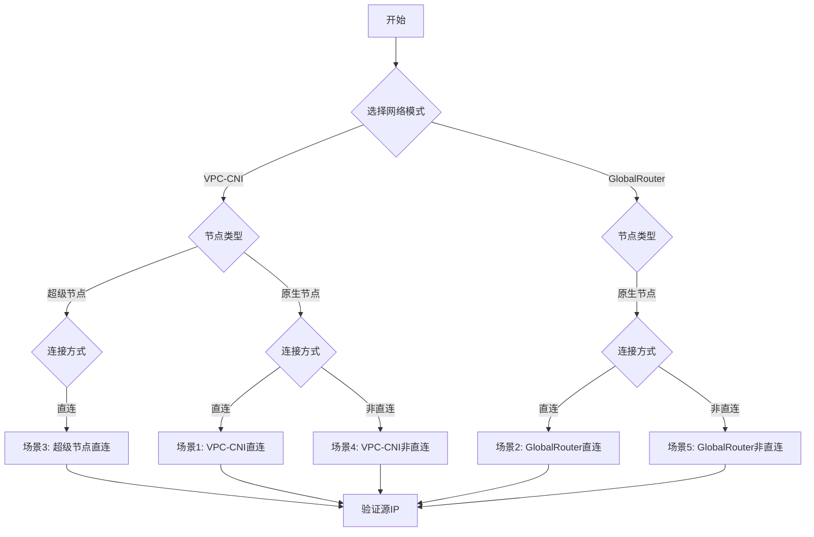

## TKE真实源IP获取方案全景指南
[English](README.md) | [中文](README_zh.md)
### **背景与必要性：解决云原生环境的关键痛点**​

在腾讯云容器服务（TKE）中，​**客户端真实源IP的获取**是安全审计、访问控制、日志分析等场景的核心需求。然而，默认的Kubernetes网络模型会导致源IP被替换为节点IP

例如：
- 非直连模式下流量经过NodePort转发，源IP丢失；
- 直连模式未正确配置时，CLB无法穿透节点直达Pod。

本项目提供**五种标准化场景的解决方案**，覆盖TKE两种网络模式和两种节点类型，确保业务零改造获取真实客户端IP。

### **项目核心价值**

​**1.直击企业级安全刚需**

- ​**合规性保障**​：满足金融、政务等场景对访问源追溯的强制要求；
- ​**零信任网络基础**​：真实IP是动态鉴权、DDoS防御的关键依据；
- ​**精准流量治理**​：基于源IP的灰度发布、地域限制。

​**2.性能与成本双重优化**​

|**模式**​|​**优势**​|​**适用场景**​|
|:-:|:-:|:-:|
|​**直连Pod**​|无需NodePort，降低延迟|高频交易、实时风控|
|​**非直连Pod**​|兼容存量业务，无需重构|传统业务迁移|


### 🧩 五大场景对比


|**场景**|**网络模式**|**连接方式**|**节点类型**|**核心特征**|
|:-:|:-:|:-:|:-:|:-:|
|**场景1**|VPC-CNI|直连|原生节点|direct-access: true |
|**场景2**|GlobalRouter|直连|原生节点|GlobalRouteDirectAccess=true,direct-access: true|
|**场景3**|VPC-CNI|直连|超级节点|天然支持直连|
|**场景4**|VPC-CNI|非直连|原生节点|type: NodePort + ingress.class: qcloud |
|**场景5**|GlobalRouter|非直连|原生节点|type: NodePort + ingress.class: qcloud |

### 📊 部署流程总图



## 🔧 业务场景配置举例说明

### 场景1：VPC-CNI直连pod（原生节点）​​
```
# 以service.yaml文件配置为例
# 核心特征​
# 通过direct-access: true注解启用CLB直连Pod
# 源IP通过TCP层remote_addr直接获取

apiVersion: v1
kind: Service
metadata:
  name: clb-direct-pod
  annotations:
    service.cloud.tencent.com/direct-access: "true"  # 核心直连开关
    service.cloud.tencent.com/loadbalance-type: "OPEN"  # 公网CLB
spec:
  selector:
    app: real-ip-app  # 匹配Deployment标签
  type: LoadBalancer
  ports:
    - protocol: TCP
      port: 80        # Service端口
      targetPort: 5000 # 业务实际端口（需与Deployment一致）
```


### 场景2：GlobalRouter直连pod（原生节点）​​

```
# 以service.yaml文件配置为例
# 核心特征
# 依赖ConfigMap全局开关 GlobalRouteDirectAccess:"true"
# 源IP通过remote_addr直接获取

apiVersion: v1
kind: Service
metadata:
  name: clb-direct-pod
  annotations:
    service.cloud.tencent.com/direct-access: "true"  # 直连开关
spec:
  selector:
    app: real-ip-app
  type: LoadBalancer
  ports:
    - protocol: TCP
      port: 80
      targetPort: 5000
```
```
前置集群配置（必做）
kubectl patch cm tke-service-controller-config -n kube-system \
  --patch '{"data":{"GlobalRouteDirectAccess":"true"}}'  # 启用全局直连
```


### 场景3： VPC-CNI直连pod（超级节点）

```
# 以service.yaml文件配置为例
# 核心特征：​​
# ​无需节点SSH操作，超级节点自动托管
# 源IP通过remote_addr获取

apiVersion: v1
kind: Service
metadata:
  name: clb-direct-pod
  annotations:
    service.cloud.tencent.com/direct-access: "true"  # 直连开关
spec:
  selector:
    app: real-ip-app
  type: LoadBalancer
  ports:
    - protocol: TCP
      port: 80
      targetPort: 5000
```


### 场景4：VPC-CNI非直连pod（原生节点）​​
```
# 以ingress.yaml文件配置为例
# 核心特征
# ingress.class: qcloud​：这是必须的注解，缺少此注解会导致源 IP 丢失
# 通过X-Forwarded-For请求头获取源IP
# Service类型必须为NodePort

apiVersion: networking.k8s.io/v1
kind: Ingress
metadata:
  name: real-ip-ingress
  namespace: kestrel-catchip  # 替换为您的命名空间（如 default 或自定义）
  annotations:
    kubernetes.io/ingress.class: qcloud  # 核心注解：启用腾讯云 CLB 七层转发
spec:
  rules:
  - http:
      paths:
      - path: /  # 路由路径，根据业务调整（如 /api）
        pathType: Prefix
        backend:
          service:
            name: real-ip-service  # 必须匹配您的 Service 名称
            port:
              number: 80  # Service 端口，与 service.yaml 中 port 一致
```


### 场景5：GlobalRouter非直连pod（原生节点）

```
# 以ingress.yaml文件配置为例
# 核心特征​​
# ingress.class: qcloud​：这是必须的注解，缺少此注解会导致源 IP 丢失
# 通过X-Forwarded-For头传递源IP
# Service类型必须为NodePort

apiVersion: networking.k8s.io/v1
kind: Ingress
metadata:
  name: real-ip-ingress
  namespace: kestrel-catchip  # 替换为您的命名空间（如 default 或自定义）
  annotations:
    kubernetes.io/ingress.class: qcloud  # 核心注解：启用腾讯云 CLB 七层转发
spec:
  rules:
  - http:
      paths:
      - path: /  # 路由路径，根据业务调整（如 /api）
        pathType: Prefix
        backend:
          service:
            name: real-ip-service  # 必须匹配您的 Service 名称
            port:
              number: 80  # Service 端口，与 service.yaml 中 port 一致
```


>​**预置镜像说明**​
- ​**四层服务镜像**​：`vickytan-demo.tencentcloudcr.com/kestrelli/images:v1.0`（适用于直连场景）
- ​**七层服务镜像**​：`test-angel01.tencentcloudcr.com/kestrelli/kestrel-seven-real-ip:v1.0`（适用于非直连场景）
