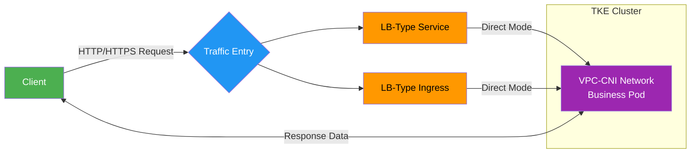
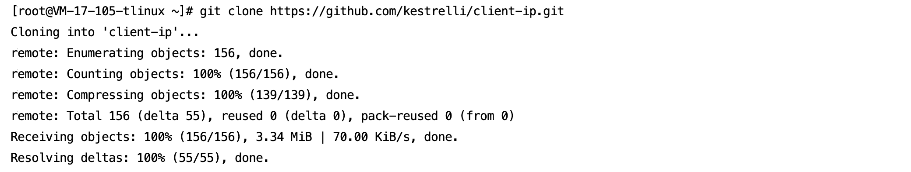
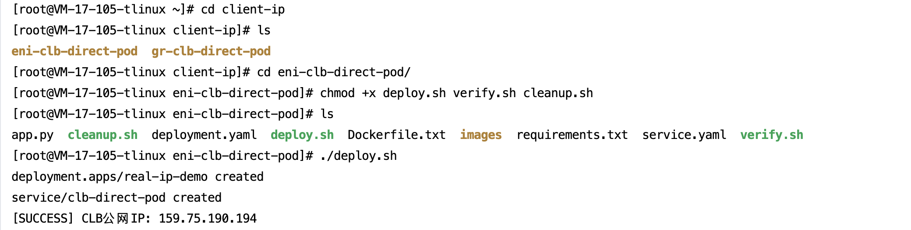
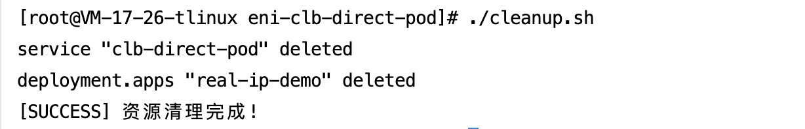

[English](README.md) | [中文](README_zh.md)


## 📌  **Overview**​

This solution leverages Tencent Cloud TKE's ​**VPC-CNI network mode**​ to enable CLB direct access to business Pods, ensuring 100% preservation of the client's real source IP. Benefits include:
-  Resolving source IP loss in traditional NodePort mode
- Meeting security audit requirements for finance, e-commerce, and regulated industries

>**Core Value**: Full automation via three scripts - deployment to validation in minutes

**Automation Workflow**:
 - `deploy.sh`: One-click application and Service deployment
- `verify.sh`: One-click client source IP validation
- `cleanup.sh`: One-click resource cleanup

## 📡 Business Access Flow




## 🛠️  Prerequisites

### 1. Environment Preparation

##### 1.1 **TKE Cluster Requirements**​ 
 - Network Mode: VPC-CNI
- Kubernetes Version: ≥ 1.20

##### **1.2 Local Tools**​
Install kubectl:
  curl -LO https://dl.k8s.io/release/v1.25.0/bin/linux/amd64/kubectl  
  chmod +x kubectl && sudo mv kubectl /usr/local/bin/  

##### 1.3 **Cluster Credentials**​ 
Obtain cluster access credentials: Refer to [Connecting to Clusters](https://cloud.tencent.com/document/product/457/39814)

### 2. Test Images

- **Default Image**: `vickytan-demo.tencentcloudcr.com/kestrelli/images:v1.0`
- **Custom Image**: Modify image address in `deploy.sh`

## 🚀  Quick Start

##### This demo uses LB-type Service. LB-type Ingress follows the same workflow.

###  Step 1: Deploy Application
```
# Clone project
git clone https://github.com/kestrelli/client-ip.git 
cd client-ip/eni-clb-direct-pod

# Grant execution permissions
chmod +x deploy.sh verify.sh cleanup.sh 

# One-click deployment
./deploy.sh  
```
Deployment completes in ~1 minute, automatically creating:
 - Business Deployment
- Direct-access Service
- CLB public IP




###  Step 2: Verify Source IP
```
# Run verification
./verify.sh

# Expected Output:
Verification Result:
{"remote_addr":"10.15.17.26"} 
Client real IP displayed in remote_addr field
```


###  Step 3: Cleanup Resources
```
# Run cleanup
./cleanup.sh
```


### ✅  Verification Checklist
|​**Stage**​|​**SuccessIndicator**​|​**CheckCommand**​|
|:-:|:-:|:-:|
|​**Deployed**​|CLB has public IP|`kubectl get svc clb-direct-pod`|
|​**Direct Access**|Annotation shows `direct-access: true`|`kubectl describe svc clb-direct-pod`|
|​**Correct IP**​|Returned IP ≠ Node IP|`./verify.sh`|
|​**Cleaned Up**​|No related resources|`kubectl get svc,deploy`|

### 📦 Project Structure
```
eni-clb-direct-pod/  
├── deploy.sh       # Deployment script  
├── verify.sh       # Verification script  
├── cleanup.sh      # Cleanup script  
├── README.md       # Documentation  
└── images/         # Screenshots directory
```
