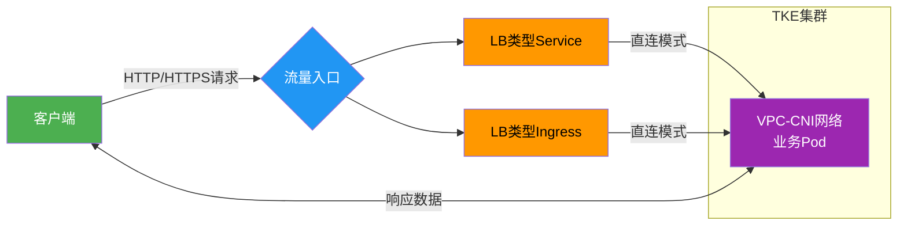

[English](README.md) | [中文](README_zh.md)

## 📌 概述

本方案通过腾讯云TKE的**VPC-CNI网络模式**实现CLB直接访问业务Pod，确保业务应用获取100%真实的客户端源IP。使用本方案可：
- 解决传统NodePort模式源IP丢失问题
- 满足金融、电商等场景的安全审计需求

>​**核心价值**​：通过三个脚本实现全流程自动化管理，部署到验证仅需几分钟

通过三个脚本实现全流程管理：
- `deploy.sh`：一键部署应用和Service
- `verify.sh`：一键验证客户端源IP
- `cleanup.sh`：一键清理资源

## 📡 业务访问链路流程图​




## 🛠️ 前提条件

### 1. 环境准备

##### 1.1 TKE集群要求  
- 网络模式：VPC-CNI  
- Kubernetes版本：≥ 1.20  

##### 1.2 本地工具  
- 安装kubectl（执行下方命令）：  
  curl -LO https://dl.k8s.io/release/v1.25.0/bin/linux/amd64/kubectl  
  chmod +x kubectl && sudo mv kubectl /usr/local/bin/  

##### 1.3 集群凭证  
获取集群访问凭证说明：请参考[连接集群](https://cloud.tencent.com/document/product/457/39814)

### 2. 业务测试镜像

- ​**默认测试镜像**​：`vickytan-demo.tencentcloudcr.com/kestrelli/images:v1.0`
- ​**自定义镜像**​：需修改`deploy.sh`中的镜像地址

## 🚀 快速开始

### 本次操作以LB类型svc为例，LB类型ingress同样适用于此业务场景

### 步骤1：部署应用
```
# 获取项目代码
git clone git clone https://github.com/kestrelli/client-ip.git 
cd client-ip
cd eni-clb-direct-pod
# 授予执行权限
chmod +x deploy.sh verify.sh cleanup.sh 
# 一键部署
./deploy.sh  
```
部署过程约1分钟，自动完成：
- 创建业务负载(Deployment)
- 配置直连Service
- 获取CLB公网IP


### 步骤2：验证源IP
```
# 运行验证脚本
./verify.sh
# 预期输出：
验证结果：
{"remote_addr":"10.15.17.26"} 
客户端真实IP显示在 remote_addr 字段
```


### 步骤3：清理资源
```
# 运行清除脚本
./cleanup.sh
```


### ✅ 验证标准

|验证阶段|成功标志|检查命令|
|:-:|:-:|:-:|
|​**部署完成**​|CLB有公网IP|kubectl get svc clb-direct-pod|
|​**直连生效**​|注解显示direct-access: true|kubectl describe svc clb-direct-pod|
|​**源IP正确**​|返回IP≠节点IP|./verify.sh|
|​**清理完成**​|无相关资源|kubectl get svc,deploy|

### 📦 项目结构
```
eni-clb-direct-pod/  
├── deploy.sh       # 一键部署脚本  
├── verify.sh       # 验证脚本  
├── cleanup.sh      # 清理脚本  
├── README.md       # 本文档 
```
