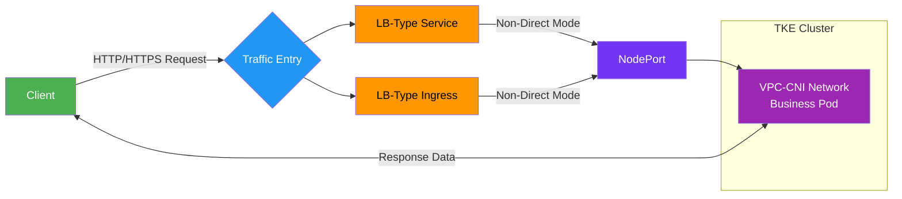
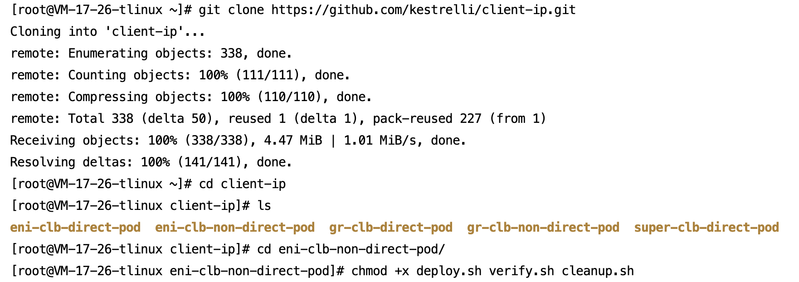
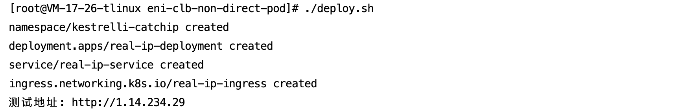
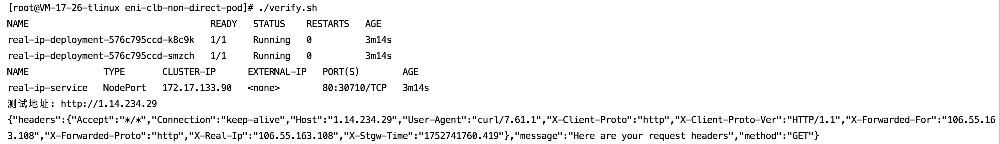
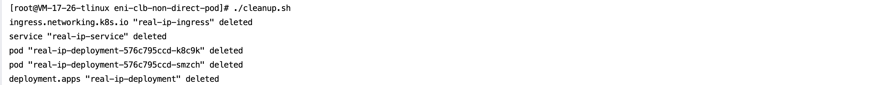

[English](README.md) | [中文](README_zh.md)

## 📌 **Overview**​

In TKE clusters, Layer 7 Cloud Load Balancers (CLB) often need to preserve the client's real source IP.
This solution leverages Tencent Cloud TKE's ​**VPC-CNI network mode**​ with Ingress in non-direct Pod mode (NodePort Service), enabling Layer 7 load balancing while preserving the client's real source IP.

Ideal for web applications requiring source IP extraction from HTTP headers (`X-Forwarded-For`).

>**Core Value**: Resolves source IP loss in non-direct mode with just 3 steps
- `deploy.sh`: One-click application and Service deployment
- `verify.sh`: One-click client source IP validation
- `cleanup.sh`: One-click resource cleanup

### **Key Principles**:
- Test image directly processes requests and returns `X-Forwarded-For` header
- Enables Tencent Cloud CLB Layer 7 forwarding via `ingressClassName: qcloud`

### 📡 Business Access Flow



## 🛠 Prerequisites
Ensure all requirements are met before deployment:
1. **Tencent Cloud Account**​
- Activated services: TKE, CVM, Container Registry
- Activated CLB service

2. ​**TKE Cluster**​
- Version ≥ 1.14
- Network mode: VPC-CNI
- Ingress enabled
- `kubectl` configured
Obtain cluster credentials:[Obtain cluster credentials:](https://cloud.tencent.com/document/product/457/39814)

3. **Network Connectivity**​
- Cluster VPC can access registry `test-angel01.tencentcloudcr.com`
- Test: `docker pull test-angel01.tencentcloudcr.com/kestrelli/kestrel-seven-real-ip:v1.0`

4. **Test Images**​
**Default Image**: `test-angel01.tencentcloudcr.com/kestrelli/kestrel-seven-real-ip:v1.0`
**Custom Image**: Modify address in `deploy.sh`

##  🚀 Quick Start
### Step 1: Deploy Application

```
# Clone project
git clone https://github.com/kestrelli/client-ip.git 
cd client-ip/eni-clb-non-direct-pod

# Grant execution permissions
chmod +x deploy.sh verify.sh cleanup.sh 

# One-click deployment
./deploy.sh  
```
Deployment completes in ~1 minute, automatically creating:
- Namespace
- Business Deployment
- NodePort Service
- Ingress routing
- Ingress public IP




###  Step 2: Verify Source IP
```
# Run verification
./verify.sh

# Expected Output:
Verification Result:
X-Forwarded-For: 106.55.163.108  
```



### Step 3: Cleanup Resources

```
# Run cleanup
./cleanup.sh
```



### ✅ Verification Checklist
|​**Item**​|​**SuccessCriteria**​|​**CheckCommand**​|
|:-:|:-:|:-:|
|​**Deployment Status**​|All resources created successfully|`kubectl get all -n kestrelli-catchip`|
|​**Ingress Status**​|Ingress has public IP|`kubectl get ingress -n kestrelli-catchip`|
|​**Source IP Validation**​|Returns X-Forwarded-For header|`./verify.sh`|

### 📂 Project Structure

```
eni-clb-non-direct-pod/  
├── deploy.sh        # Deployment script  
├── verify.sh        # Verification script  
├── cleanup.sh       # Cleanup script  
└── README.md        # Documentation
