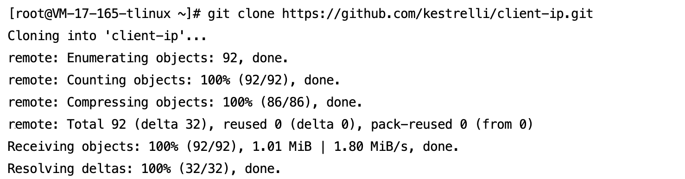

[English](README.md) | [中文](README_zh.md)

## **Link Overview & Value**

In GlobalRouter network mode, the CLB-direct-to-Pod access path completely bypasses traditional NodePort forwarding, enabling end-to-end source IP preservation. This design resolves common Kubernetes source IP loss issues (e.g., SNAT conversion in NodePort mode), particularly suited for:

- **Security Auditing**: Accurately records client real IPs for compliance (e.g., GDPR)
- **Real-time Risk Control**: Enables IP-based access policies (e.g., geo-blocking)
- **Log Analytics**: Preserves raw IP logs without additional parsing, improving ELK pipeline efficiency

>​**Core Value**: Achieves 100% source IP retention via CLB-direct-to-Pod. Verification output `{"remote_addr":"172.19.0.65"}` shows real client public IP, not node IP (e.g., 42.194.172.41).

**Automation Workflow**:
- `deploy.sh`: One-click application and Service deployment
- `verify.sh`: One-click client source IP validation
- `cleanup.sh`: One-click resource cleanup

##  📡 Business Access Flow


##  🛠 Prerequisites

1. **TKE Cluster**​
	- Kubernetes version ≥ 1.20
	- Network mode: GlobalRouter
2. **Local Environment**​

```
# Install kubectl (skip if installed)
curl -LO "https://dl.k8s.io/release/$(curl -L -s https://dl.k8s.io/release/stable.txt)/bin/linux/amd64/kubectl"
chmod +x kubectl && sudo mv kubectl /usr/local/bin/
```
3. **Cluster Credentials**​

Obtain access credentials:[Connecting to Clusters](https://cloud.tencent.com/document/product/457/39814)

##  🚀 Quick Start

##### This demo uses LB-type Service. LB-type Ingress follows the same workflow.

### Step 1: Deploy Application

```
# 1. Clone project
git clone https://github.com/kestrelli/client-ip.git
cd client-ip/gr-clb-direct-pod

# 2. Grant execution permissions
chmod +x *.sh

# 3. One-click deployment
./deploy.sh
```
Deployment completes in ~1 minute, automatically:
- Enables GlobalRoute direct mode
- Creates business Deployment
- Configures direct-access Service
- Obtains CLB public IP




### Step 2: Verify Source IP

```
# Run verification
./verify.sh

# Expected Output:
Verification Result:
{"remote_addr":"172.19.0.65"} 
Client real IP displayed in remote_addr field
```


### Step 3: Cleanup Resources
```
# One-click cleanup
./cleanup.sh
```


### ✅ Verification Standards

**IP Validation**​
Run `./verify.sh` - output must include:
`{"remote_addr":"Client Real Public IP"}`
>Must match actual client IP

#### **Custom Test Image**​

```
# Modify image in deploy.sh
sed -i 's|vickytan-demo.tencentcloudcr.com|your-registry.com/your-image|g' deploy.sh
```

### 📦 Project Structure
```
gr-clb-direct-pod/
├── deploy.sh      # Deployment script  
├── verify.sh      # Verification script  
├── cleanup.sh     # Cleanup script  
└── README.md      # Documentation    
```
