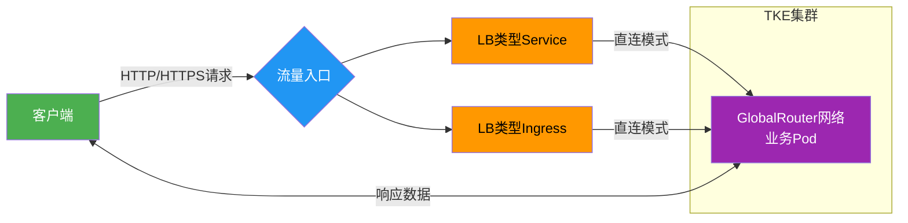
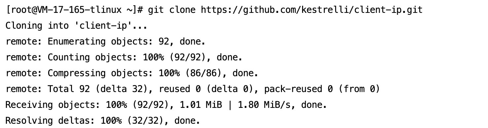
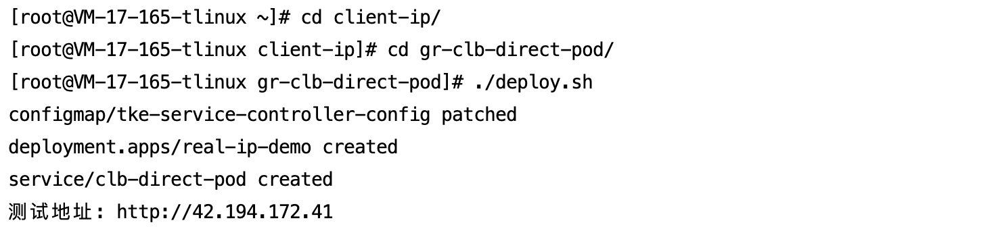
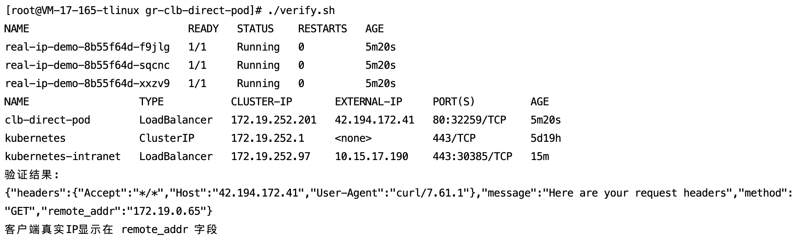
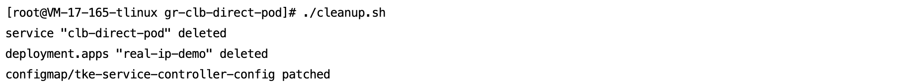

[English](README.md) | [中文](README_zh.md)

## 链路概述与价值​

在GlobalRouter网络模式下，CLB直连Pod的业务访问链路完全绕过传统NodePort转发层，实现端到端的源IP透传。此设计解决了Kubernetes环境中常见的源IP丢失问题（如NodePort模式的SNAT转换），特别适用于：

- 安全审计场景​：精准记录客户端真实IP，满足合规要求（如GDPR）。
- 实时风控系统​：基于IP的访问控制策略（如geo-blocking）。
- 日志分析​：原始IP日志无需额外解析，提升ELK等管道效率。

>​**核心价值**​：通过CLB直连Pod，源IP保留率可达100%，验证输出 {"remote_addr":"172.19.0.65"} 直接体现客户端真实公网IP，非节点IP（如42.194.172.41）。

通过三个脚本实现全流程管理：
- `deploy.sh`：一键部署应用和Service
- `verify.sh`：一键验证客户端源IP
- `cleanup.sh`：一键清理资源

## 📡 业务访问链路流程图



## 🛠 前提条件

1. ​**TKE集群**​
	- Kubernetes版本 ≥ 1.20
	- 网络模式 = GlobalRouter
2. ​**本地环境**​

```
# 安装kubectl (已安装可跳过)
curl -LO "https://dl.k8s.io/release/$(curl -L -s https://dl.k8s.io/release/stable.txt)/bin/linux/amd64/kubectl"
chmod +x kubectl && sudo mv kubectl /usr/local/bin/
```
3. ​**集群凭证**

获取集群访问凭证说明：请参考[连接集群](https://cloud.tencent.com/document/product/457/39814)

## 🚀 快速开始

##### 本次操作以LB类型svc为例，LB类型ingress同样适用于此业务场景

### 步骤1：部署应用

```
# 1. 下载项目
git clone https://github.com/kestrelli/client-ip.git
cd client-ip
cd gr-clb-direct-pod
# 2. 授权执行权限
chmod +x *.sh
# 3. 一键部署
./deploy.sh
```
部署过程约1分钟，自动完成：
- 启用GlobalRoute直连模式
- 创建业务负载(Deployment)
- 配置直连Service
- 获取CLB公网IP






### 步骤2：验证源IP

```
# 运行验证脚本
./verify.sh

# 预期输出：
验证结果：
{"remote_addr":"172.19.0.65"} 
客户端真实IP显示在 remote_addr 字段
```


### 步骤3：清理资源
```
# 一键清理（删除Service/Deployment并关闭直连模式）
./cleanup.sh
```



### ✅ 验证标准

​**IP验证**

运行`./verify.sh`输出需包含：
`{"remote_addr":"客户端真实公网IP"}`
>对比客户端真实IP必须一致
	

#### 自定义业务测试镜像

```
# 修改deploy.sh中的镜像地址
sed -i 's|vickytan-demo.tencentcloudcr.com|your-registry.com/your-image|g' deploy.sh
```


### 📦 项目结构
```
gr-clb-direct-pod/
├── deploy.sh      # 一键部署脚本  
├── verify.sh      # 验证脚本  
├── cleanup.sh     # 清理脚本  
└── README.md      # 本文档  
```
