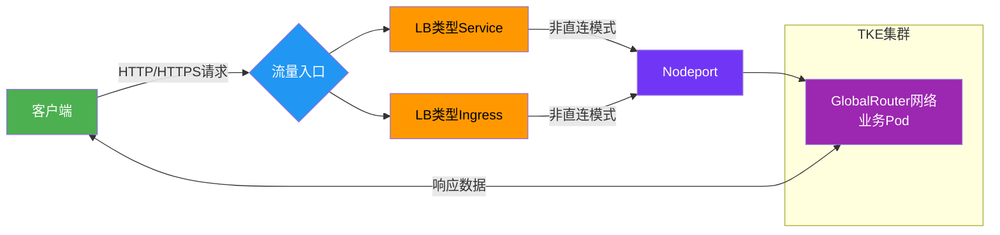
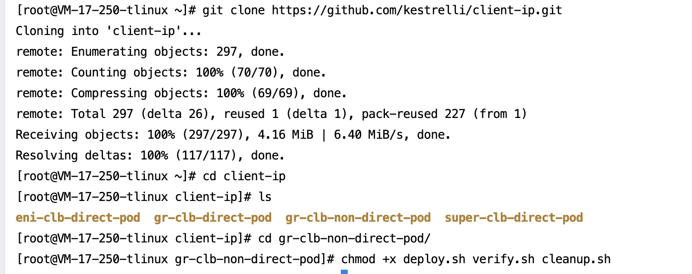
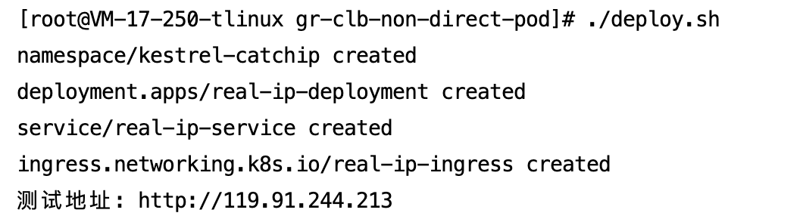
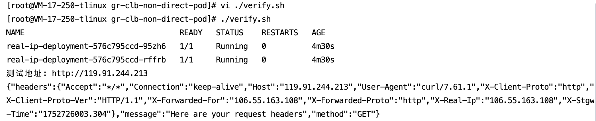
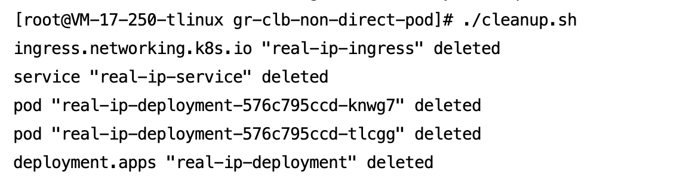

[English](README.md) | [中文](README_zh.md)
​
## 📌 概述

本方案在腾讯云TKE的GlobalRouter网络模式下，通过Ingress Controller实现七层负载均衡，获取客户端真实源IP。适用于需要从HTTP头中提取源IP的业务场景（如Web应用、API网关）。
>​**核心价值**​：解决非直连模式下源IP丢失问题，通过`X-Forwarded-For`头传递真实客户端IP

通过三个脚本实现全流程管理：
- `deploy.sh`：一键部署应用和Service
- `verify.sh`：一键验证客户端源IP
- `cleanup.sh`：一键清理资源


## 📡 业务访问链路流程图




## 🛠️ 前提条件

### 1. 集群要求

- 网络模式：GlobalRouter  
- Kubernetes版本：≥ 1.18  
- 已启用Ingress功能  

### 2. 必备工具
- kubectl（v1.18+）  
- curl  

### 3. 账户要求  
- 已开通CLB服务   
- 获取集群访问凭证说明：请参考[连接集群](https://cloud.tencent.com/document/product/457/39814)

### 4. 业务测试镜像

- ​**默认测试镜像**​：`test-angel01.tencentcloudcr.com/kestrelli/kestrel-seven-real-ip:v1.0 `
- ​**自定义镜像**​：需修改`deploy.sh`中的镜像地址


## 🚀 快速开始
### 步骤1：部署应用

```
# 获取项目代码
git clone https://github.com/kestrelli/client-ip.git 
cd client-ip
cd gr-clb-non-direct-pod
# 授予执行权限
chmod +x deploy.sh verify.sh cleanup.sh 
# 一键部署
./deploy.sh  
```
部署过程约1分钟，自动完成：
- 创建命名空间
- 部署业务负载(Deployment)
- 配置Nodeport Service服务
- 配置Ingress路由 
- 获取ingress公网IP




### 步骤2：验证源IP

```
# 运行验证脚本
./verify.sh
# 预期输出：
验证结果：
X-Forwarded-For: 106.55.163.108 
```


### 步骤3：清理资源

```
# 运行清除脚本
./cleanup.sh
```



### ✅ 验证标准


|验证项|成功标准|检查命令|
|:-:|:-:|:-:|
|​**部署状态**​|所有资源创建成功|`kubectl get all -n kestrelli-catchip `|
|​**Ingress状态**​|Ingress有公网IP|`kubectl get ingress -n kestrelli-catchip `|
|​**源IP验证**​|返回X-Forwarded-For头|`./verify.sh`|


#### 自定义业务测试镜像
```
# 修改deploy.sh中的镜像地址  
sed -i 's|test-angel01.tencentcloudcr.com|your-registry.com|g' deploy.sh  
```
### 📦 项目结构
```
gr-clb-non-direct-pod/  
├── deploy.sh        # 一键部署脚本  
├── verify.sh        # 验证脚本  
├── cleanup.sh       # 清理脚本  
├── README.md        # 本文档   
```
