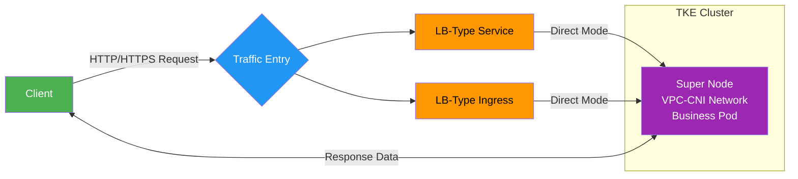
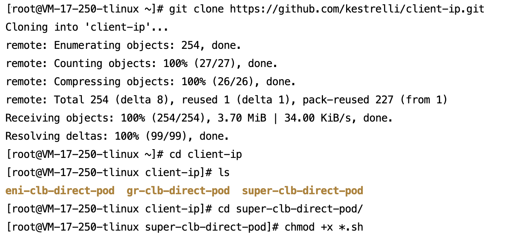
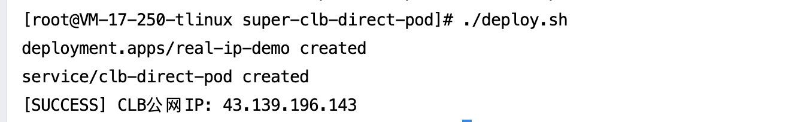
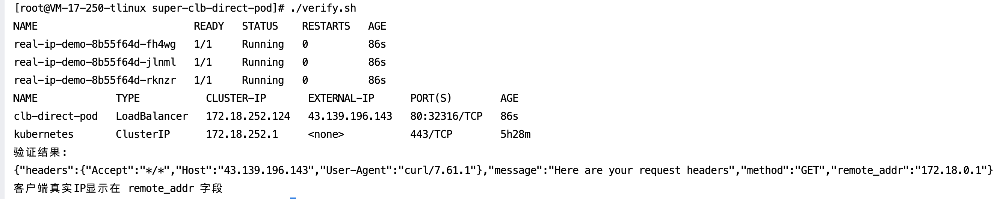
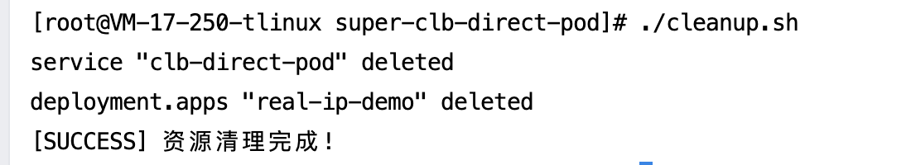

[English](README.md) | [中文](README_zh.md)


## Project Overview​

This open-source project provides a one-click solution for preserving client real source IP in Tencent Kubernetes Engine (TKE) Super Node mode using CLB-direct-to-Pod access. Ideal for audit, risk control, and other source-IP-sensitive scenarios. Core advantages:

- ​**One-Click Deployment**​: Automates Deployment and Service creation, eliminating manual steps
- ​**​Instant Validation**​：Automatically retrieves CLB IP and tests source IP in real-time
- ​**Out-of-Box Usability**​：Based on standard Kubernetes commands, no complex configuration

Automation Workflow:
- `deploy.sh`：One-click application and Service deployment
- `verify.sh`：One-click client source IP validation
- `cleanup.sh`：One-click resource cleanup

## 📡 Business Access Flow



## 🛠 Prerequisites

Before execution, ensure your environment meets these requirements:
- ​**Cluster Environment**​：
    - TKE cluster with Super Node enabled (Console path: Node Management → Node Pool → Enable Super Node)
	- VPC-CNI network mode (selected during cluster creation)
- ​**Resource Requirements**​：
    - Sufficient Tencent Cloud account balance
    - No bandwidth restrictions
	- Obtain cluster credentials: refer to [Connecting to Clusters](https://cloud.tencent.com/document/product/457/39814)
- ​**Image Specification**​：
    - Default test image: `vickytan-demo.tencentcloudcr.com/kestrelli/images:v1.0`
    - Customize in ./deploy.sh as needed

##  🚀 Quick Start
##### This demo uses LB-type Service. LB-type Ingress follows the same workflow.

###  Step 1: Deploy Application

```
# 1. Clone project
git clone https://github.com/kestrelli/client-ip.git
cd client-ip/super-clb-direct-pod

# 2. Grant execution permissions
chmod +x *.sh

# 3. Run deployment (requires kubectl access)
./deploy.sh
```
Deployment completes in ~1 minute, automatically:
- Enables GlobalRoute direct mode
- Creates business Deployment
- Configures direct-access Service
- Obtains CLB public IP




### Step 2: Verify Source IP

```
# Run verification
./verify.sh

# Expected Output:
Verification Result:
{"remote_addr":"172.18.0.1"} 
Client real IP displayed in remote_addr field
```


###  Step 3: Cleanup Resources

```
# Run cleanup (requires kubectl access)
./cleanup.sh
```


## ✅ Verification Checklist


|​**Item**​|​**SuccessCriteria**​|​**CheckCommand**​|
|:-:|:-:|:-:|
|​**Deployment Status**​|Deployment Available, all Pods Running|`kubectl get deploy real-ip-app`<br>`kubectl get pods -l app=real-ip-app`|
|​**Service Status**​|Service has public IP|`kubectl get svc clb-direct-pod`|
|​**Source IP Validation**​|Returns real client IP|`./verify.sh`|
#### ​**Custom Test Image**​
```
# Modify image in deploy.sh
sed -i 's|vickytan-demo.tencentcloudcr.com|your-registry.com|g' deploy.sh
```

###  ⚠️ Troubleshooting


|**Symptom**​|​**Solution**​|
|:-:|:-:|
|​**Pod Status Abnormal**​|`kubectl describe pod <pod-name>`<br>`kubectl logs <pod-name>`|
|​**No Service Public IP**​|Check account balance and CLB quota|
|​**Returns Node IP**​|Confirm Service annotation `service.cloud.tencent.com/direct-access: "true"`|
|​**Connection Timeout**​|Verify security group rules and network ACLs|

### 📦 Project Structure

```
super-clb-direct-pod/
├── deploy.sh       # Deployment script
├── verify.sh       # Verification script
├── cleanup.sh      # Cleanup script
└── README.md       # Documentation
```
