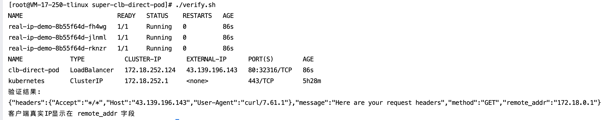

[English](README.md) | [中文](README_zh.md)

## 项目概述

本开源项目提供一键式解决方案，在腾讯云容器服务（TKE）超级节点模式下，通过CLB直连Pod模式，获取客户端真实源IP。适用于审计、风控等对源IP敏感的场景。核心优势：
- ​**一键部署**​：整合Deployment和Service创建，避免手动步骤。
- ​**一键验证**​：自动获取CLB IP并测试源IP，确保业务实时生效。
- ​**开箱即用**​：基于标准Kubernetes命令，无需复杂配置。

通过三个脚本实现全流程管理：
- `deploy.sh`：一键部署应用和Service
- `verify.sh`：一键验证客户端源IP
- `cleanup.sh`：一键清理资源

## 📡 业务访问链路流程图

```mermaid
graph LR
    
    A[客户端] -->|HTTP/HTTPS请求| B{流量入口}
    B --> C[LB类型Service]
    B --> D[LB类型Ingress]
    
    C -->|直连模式| E[业务Pod]
    D -->|直连模式| E
    
    subgraph TKE集群
        E[超级节点<br>VPC-CNI网络<br>业务Pod]
    end
    
     A <--> |响应数据| E
    
    style A fill:#4CAF50,color:white
    style B fill:#2196F3,color:white
    style C fill:#FF9800,color:black
    style D fill:#FF9800,color:black
    style E fill:#9C27B0,color:white
```

## 🛠 前置条件

在执行一键操作前，确保您的环境满足以下要求：
- ​**集群环境**​：TKE集群已启用超级节点（控制台路径：节点管理 → 节点池 → 启用超级节点）。
	- 集群网络模式为VPC-CNI（创建集群时需选择）。
- ​**资源要求**​：腾讯云账户余额充足，无带宽限制（避免访问失败）。
	- 获取集群访问凭证说明：请参考[连接集群](https://cloud.tencent.com/document/product/457/39814)
- ​**镜像说明**​：默认使用测试镜像 `vickytan-demo.tencentcloudcr.com/kestrelli/images:v1.0`，您可在./deploy.sh文件中自定义替换。

## 🚀 快速开始
##### 本次操作以LB类型svc为例，LB类型ingress同样适用于此业务场景

### 步骤1：部署应用

```
# 1. 下载项目
git clone https://github.com/kestrelli/client-ip.git
cd client-ip
cd super-clb-direct-pod
# 2. 授权执行权限
chmod +x *.sh
# 3. 执行部署脚本（需要kubectl权限）
./deploy.sh
```
部署过程约1分钟，自动完成：
- 启用GlobalRoute直连模式
- 创建业务负载(Deployment)
- 配置直连Service
- 获取CLB公网IP


### 步骤2：验证源IP

```
# 运行验证脚本
./verify.sh

# 预期输出：
验证结果：
{"remote_addr":"172.18.0.1"} 
客户端真实IP显示在 remote_addr 字段
```


### 步骤3：清理资源

```
# 执行清理脚本（需要kubectl权限）
./cleanup.sh
```


## ✅ 验证标准


|验证项|成功标准|检查命令|
|:-:|:-:|:-:|
|​**部署状态**​|Deployment状态Available，Pod全部Running|`kubectl get deploy real-ip-app`<br>`kubectl get pods -l app=real-ip-app`|
|​**Service状态**​|Service有公网IP|`kubectl get svc clb-direct-pod`|
|​**源IP验证**​|返回真实客户端IP|`./verify.sh`|

#### 自定义业务测试镜像
```
# 修改deploy.sh中的镜像地址
sed -i 's|vickytan-demo.tencentcloudcr.com|your-registry.com|g' deploy.sh
```

### ⚠️ 故障排查


|现象|解决方案|
|:-:|:-:|
|Pod状态异常|`kubectl describe pod <pod-name>`<br>`kubectl logs <pod-name>`|
|Service无公网IP|检查账户余额和CLB配额|
|获取到节点IP|确认Service注解 `direct-access: "true"`|
|访问超时|检查安全组规则和网络ACL|

### 📦 项目结构

```
super-clb-direct-pod/
├── deploy.sh       # 一键部署脚本
├── verify.sh       # 验证脚本
├── cleanup.sh      # 清理脚本
├── README.md       # 本文档
```
