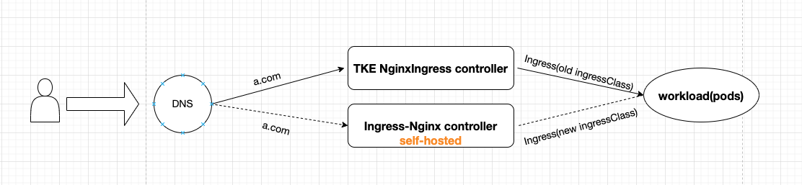

# 从 TKE Nginx Ingress 插件迁移到自建 Nginx Ingress

## 背景
TKE Nginx Ingress 扩展组件已不再支持 TKE 1.30 及以上版本。若需升级集群版本至 1.30 或更高，需移除低版本集群中的 Nginx Ingress 扩展组件，并切换至社区版 Nginx Ingress。

为了实现现网流量的无损切换，本文档针对这一升级场景，整理了已验证的具体操作步骤，帮助低版本集群在复用现有 IngressClass 和 Service 的前提下，顺利完成 TKE Nginx Ingress 的切换升级，确保业务流量平稳过渡。

## 切换升级方案

### 方案一（推荐）
官方推荐的最稳健方式：在同一集群内分别部署新旧两个版本的 Nginx Ingress 控制器。两个版本独立运行（包括独立的 IngressClass、Service 和 Pod 等资源）。切换时通过修改域名解析至新入口地址，实现平滑迁移。

### 方案二（不推荐）
直接滚动升级 Nginx Ingress Controller 的镜像版本。此方式操作简单，但依赖环境兼容性，尤其是跨高版本升级可能引入未预期的变更，现网切换风险较高。

### 方案三（非标方案）
使用社区版 Nginx Ingress Helm Chart 安装新版控制器，沿用旧版本的 IngressClass（如 `tke-nginx` 或自定义类名），并直接关联旧版本业务 Service 的端口和选择器。新旧控制器并行运行，通过负载均衡器或 DNS 按比例分发流量，观察业务稳定性（如错误率、响应延迟）。确认新版稳定后，删除旧版控制器相关资源。

## 迁移指南
本迁移指南采用**方案一**方式，通过在集群中同时运行 TKE Nginx Ingress 插件和自建 Nginx Ingress，实现平滑迁移。

### 前提条件
- Kubernetes 版本 >= 1.14 且 <= 1.28


#### 第一阶段：环境准备
部署模拟使用TKE NginxIngress组件的线上业务环境：
```bash
./deploy.sh
```


该脚本将完成：
1. 部署 TKE NginxIngress组件
2. 创建测试应用 (nginx-demo)
3. 配置基于 TKE 插件的 Ingress 规则

#### 第二阶段：升级迁移
执行完整的迁移操作：
```bash
./Ingress-chart.sh
```


在该脚本中，会自动配置 [values.yaml](file:///Users/tangtang/Desktop/Go/src/PlayBook-TKE/nginx-ingress->ingress-nginx/values.yaml) 文件来部署新的 Nginx Ingress Controller：

```yaml
controller:
  ingressClass: new-test # 新 IngressClass 名称，避免与现有 TKE 插件冲突
  ingressClassResource:
    name: new-test
    enabled: true
    controllerValue: k8s.io/new-test
```


配置说明：
- `ingressClass: new-test` - 指定新的 IngressClass 名称为 `new-test`，与 TKE 插件的 `test` 区分开来，避免冲突
- `name: new-test` - 创建名为 `new-test` 的 IngressClass 资源
- `controllerValue: k8s.io/new-test` - 设置控制器标识，确保新 Ingress 规则能被正确路由到新的控制器实例

该脚本将完成：

##### 1. 自建社区Ingress-nginx组件
- 自动安装 Helm 并配置 ingress-nginx 官方仓库
- 检测当前 TKE Nginx Ingress 的镜像版本
- 根据镜像版本匹配对应的 Helm Chart 版本
- 使用 Helm 部署社区版 ingress-nginx，配置独立的 IngressClass

##### 2. 执行平滑迁移
- 复制现有 Ingress 配置并修改 IngressClass 为 new-test
- 创建新的 Ingress 规则，实现新旧版本并存
- 验证新旧 Ingress 配置是否都正常工作
- 进行访问测试确保服务正常
- 配置 DNS 解析，将域名指向新的 Ingress 入口
- 逐步清理旧资源：删除旧 Ingress → 删除 TKE Nginx Ingress 插件

## 核心价值
通过自动化脚本实现**零停机迁移**，新旧版本并行运行，避免业务中断，完成从 TKE 插件版到社区版的平滑升级。