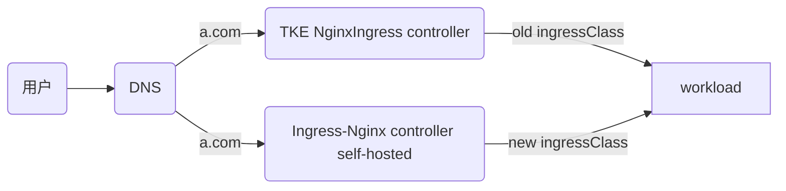

# 方案一：独立 IngressClass 方式

[English Version](./README_en.md)

本方案采用创建全新 IngressClass 的方式，实现新旧控制器的完全隔离。



### 方案特点
- 创建全新的 IngressClass（如 `new-test`），与原有 TKE IngressClass 完全独立
- 新旧控制器独立运行，互不影响
- 通过 DNS 切换实现流量迁移
- 迁移过程最为安全，回滚简单

### 适用场景
- 生产环境迁移
- 对业务连续性要求极高的场景
- 首次进行此类迁移的用户

### 前提条件
- Kubernetes 版本 >= 1.14 且 <= 1.28


### 第一阶段：环境准备
#### 部署模拟使用TKE NginxIngress组件的线上业务环境：（如已有则可选）
```bash
./install-tke-ingress.sh
```


该脚本将完成：
1. 部署 TKE NginxIngress组件 (默认watch所有命名空间ingress资源)
2. 创建测试应用 (nginx-demo)
3. 配置基于 TKE 组件的 Ingress 规则

#### 部署自建社区Ingress-nginx组件
```bash
./install-community-ingress.sh
```
[Helm 官方仓库](https://kubernetes.github.io/ingress-nginx) 


在该脚本中，会自动配置 [values.yaml](file:///Users/tangtang/Desktop/Go/src/PlayBook-TKE/nginx-ingress->ingress-nginx/values.yaml) 文件来部署新的 Ingress-nginx Controller：

```yaml
controller:
  ingressClass: new-test # 新 IngressClass 名称，避免与现有 TKE 组件冲突
  ingressClassResource:
    name: new-test
    enabled: true
    controllerValue: k8s.io/new-test
  scope:  
    enabled: true
    namespace: "ingress-nginx" # Nginx Controller监听处理指定命名空间下的Ingress资源 (可选)
```


配置说明：
- `ingressClass: new-test` - 指定新的 IngressClass 名称为 `new-test`，与 TKE 组件的 `test` 区分开来，避免冲突
- `name: new-test` - 创建名为 `new-test` 的 IngressClass 资源
- `controllerValue: k8s.io/new-test` - 设置控制器标识，确保新 Ingress 规则能被正确路由到新的控制器实例

该脚本将完成：

#### 自建社区Ingress-nginx组件
- 自动安装 Helm 并配置 ingress-nginx 官方仓库
- 检测当前 TKE NginxIngress 的镜像版本
- 根据镜像版本匹配对应的 Helm Chart 版本
- 使用 Helm 部署社区版 ingress-nginx，配置独立的 IngressClass
- 复制现有 Ingress 配置并修改 IngressClass 为 new-test
- 创建新的 Ingress 规则，实现新旧版本并存
- 验证新旧 Ingress 配置是否都正常工作
- 测试新 Ingress 暴露的业务是否可以正常访问
#### 验证新自建ingress-nginx的访问结果
````
2025-08-20 13:11:53
200 0.003802
2025-08-20 13:11:54
200 0.003316
2025-08-20 13:11:55
200 0.003405
2025-08-20 13:11:56
200 0.003368
2025-08-20 13:11:57
200 0.003500
2025-08-20 13:11:58
````

### 第二阶段：平滑迁移
#### 执行平滑迁移
```bash
./migrate.sh
```
该脚本将完成：
- 配置修改hosts解析，将域名指向新的 Ingress 入口
- 验证迁移后服务的稳定性和可用性
#### 验证迁移后的访问结果
````
2025-08-20 13:13:41
200 0.003973
2025-08-20 13:13:42
200 0.004360
2025-08-20 13:13:43
200 0.003875
2025-08-20 13:13:44
200 0.003541
2025-08-20 13:13:45
200 0.003257
2025-08-20 13:13:46
200 0.004169
````
## 核心价值
通过自动化脚本实现**零停机迁移**，新旧版本并行运行，避免业务中断，完成从 TKE 组件版到社区版的平滑升级。
