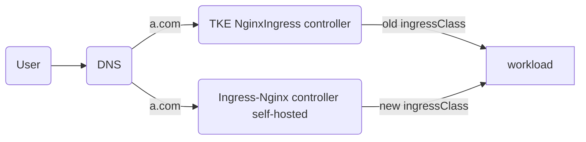

# Solution 1: Independent IngressClass Approach

This solution creates a completely new IngressClass to achieve complete isolation between new and old controllers.



### Solution Features
- Creates a completely new IngressClass (e.g., `new-test`), independent from the original TKE IngressClass
- New and old controllers operate independently without mutual interference
- Traffic migration through DNS switching
- Safest migration process with simple rollback

### Applicable Scenarios
- Production environment migration
- Scenarios with extremely high business continuity requirements
- Users conducting this type of migration for the first time

### Prerequisites
- Kubernetes version >= 1.14 and <= 1.28

### Phase 1: Environment Preparation
#### Deploy a simulated online business environment using TKE NginxIngress component: (optional if already exists)
```bash
./install-tke-ingress.sh
```

This script will complete:
1. Deploy the TKE NginxIngress component (by default watches ingress resources in all namespaces)
2. Create a test application (nginx-demo)
3. Configure Ingress rules based on the TKE component

#### Deploy self-hosted community Ingress-nginx component
```bash
./install-community-ingress.sh
```
[Helm Official Repository](https://kubernetes.github.io/ingress-nginx)

In this script, the [values.yaml](file:///Users/tangtang/Desktop/Go/src/PlayBook-TKE/nginx-ingress->ingress-nginx/values.yaml) file will be automatically configured to deploy the new Ingress-nginx Controller:

```yaml
controller:
  ingressClass: new-test # New IngressClass name to avoid conflicts with existing TKE component
  ingressClassResource:
    name: new-test
    enabled: true
    controllerValue: k8s.io/new-test
  scope:  
    enabled: true
    namespace: "ingress-nginx" # Nginx Controller listens to Ingress resources in the specified namespace (optional)
```

Configuration Explanation:
- `ingressClass: new-test` - Specifies the new IngressClass name as `new-test`, distinguishing it from TKE component's `test` to avoid conflicts
- `name: new-test` - Creates an IngressClass resource named `new-test`
- `controllerValue: k8s.io/new-test` - Sets the controller identifier to ensure new Ingress rules are correctly routed to the new controller instance

This script will complete:

#### Self-hosted Community Ingress-nginx Component
- Automatically installs Helm and configures the ingress-nginx official repository
- Detects the current TKE NginxIngress image version
- Matches the corresponding Helm Chart version based on the image version
- Deploys the community version of ingress-nginx using Helm with an independent IngressClass
- Copies existing Ingress configurations and modifies the IngressClass to new-test
- Creates new Ingress rules to enable coexistence of old and new versions
- Verifies that both old and new Ingress configurations are working properly
- Tests whether the business exposed by the new Ingress can be accessed normally

#### Verify Access Results of New Self-hosted Ingress-nginx
````
2025-08-20 13:11:53
200 0.003802
2025-08-20 13:11:54
200 0.003316
2025-08-20 13:11:55
200 0.003405
2025-08-20 13:11:56
200 0.003368
2025-08-20 13:11:57
200 0.003500
2025-08-20 13:11:58
````

### Phase 2: Smooth Migration
#### Execute Smooth Migration
```bash
./migrate.sh
```
This script will complete:
- Configures hosts resolution modification to point the domain to the new Ingress entry
- Verifies the stability and availability of services after migration

#### Verify Access Results After Migration
````
2025-08-20 13:13:41
200 0.003973
2025-08-20 13:13:42
200 0.004360
2025-08-20 13:13:43
200 0.003875
2025-08-20 13:13:44
200 0.003541
2025-08-20 13:13:45
200 0.003257
2025-08-20 13:13:46
200 0.004169
````

## Core Value
Achieve **zero-downtime migration** through automated scripts, with old and new versions running in parallel to avoid business interruption and complete smooth upgrade from TKE component version to community version.
