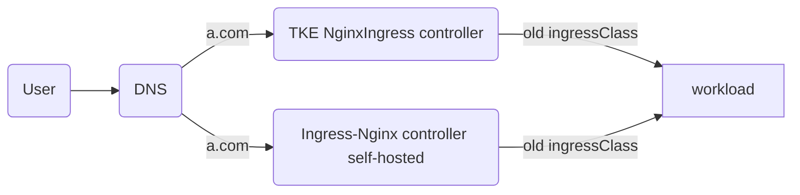

# Solution 2: Shared IngressClass Approach

This solution reuses the original IngressClass to enable both new and old controllers to share the same IngressClass.



### Solution Features
- Reuses the original IngressClass (e.g., `test`), with both new and old controllers sharing the same IngressClass
- No modification required to existing Ingress resources
- Traffic switching through weight adjustment
- Relatively complex configuration requiring precise control

### Applicable Scenarios
- Scenarios where minimal configuration changes are desired
- Environments requiring progressive migration
- Situations with numerous Ingress resources that are inconvenient to modify individually

### Prerequisites
- Kubernetes version >= 1.14 and <= 1.28

### Phase 1: Environment Preparation
#### Deploy a simulated online business environment using TKE NginxIngress component: (optional if already exists)
```bash
./install-tke-ingress.sh
```

This script will complete:
1. Deploy the TKE NginxIngress component (by default watches ingress resources in all namespaces)
2. Create a test application (nginx-demo)
3. Configure Ingress rules based on the TKE component

#### Deploy self-hosted community Ingress-nginx component
```bash
./install-community-ingress.sh
```
[Helm Official Repository](https://kubernetes.github.io/ingress-nginx)

In this script, the [values.yaml](file:///Users/tangtang/Desktop/Go/src/PlayBook-TKE/nginx-ingress->ingress-nginx/values.yaml) file will be automatically configured to deploy the new Ingress-nginx Controller:

```yaml
controller:
  name: new-controller  # New controller workload name

  # Reuse old ingress class name
  ingressClass: test

  ingressClassResource:
    name: test
    enabled: false  # Do not create new IngressClass

  # Set publish service to old service
  publishService:
    enabled: true
    pathOverride: "kube-system/test-ingress-nginx-controller"  # Old service path

  # Ensure service configuration is correct
  service:
    type: LoadBalancer
    annotations:
      service.cloud.tencent.com/custom-weight: "100"  # New controller weight value

# Other necessary configurations
rbac:
  create: true

serviceAccount:
  create: true
  name: nginx-service-account

```

Configuration Explanation:
- `controller.name: new-controller` - New controller workload name, must be different from the old one
- `ingressClass: test` - Specifies IngressClass name as `test`, the same as TKE component's IngressClass name
- `ingressClassResource.name: test` - Name of the IngressClass resource
- `ingressClassResource.enabled: false` - Disable IngressClass resource creation to ensure the new controller reuses the existing IngressClass
- `publishService.pathOverride: kube-system/test-ingress-nginx-controller` - Set publish service to the old service path
- `service.cloud.tencent.com/custom-weight: "100"` - New controller weight value, directing 100% traffic to the new controller

This script will complete:

#### Self-hosted Community Ingress-nginx Component
- Automatically installs Helm and configures the ingress-nginx official repository
- Detects the current TKE NginxIngress image version
- Matches the corresponding Helm Chart version based on the image version
- Deploys the community version of ingress-nginx using Helm with the same IngressClass as TKE NginxIngress
- Directly uses existing Ingress configurations, associating them with both new and old controllers
- Verifies that Ingress configurations are working properly
- Tests whether the business exposed by the new Ingress can be accessed normally

#### Verify Access Results of New Self-hosted Ingress-nginx
````
2025-08-20 13:11:53
200 0.003802
2025-08-20 13:11:54
200 0.003316
2025-08-20 13:11:55
200 0.003405
2025-08-20 13:11:56
200 0.003368
2025-08-20 13:11:57
200 0.003500
2025-08-20 13:11:58
````

### Phase 2: Smooth Migration
#### Execute Smooth Migration
```bash
./migrate.sh
```
This script will complete:
- Configures hosts resolution modification to point the domain to the new Ingress entry
- Verifies the stability and availability of services after migration

#### Verify Access Results After Migration
````
2025-08-20 13:13:41
200 0.003973
2025-08-20 13:13:42
200 0.004360
2025-08-20 13:13:43
200 0.003875
2025-08-20 13:13:44
200 0.003541
2025-08-20 13:13:45
200 0.003257
2025-08-20 13:13:46
200 0.004169
````

## Core Value
Achieve **zero-downtime migration** through automated scripts, with old and new versions running in parallel to avoid business interruption and complete smooth upgrade from TKE component version to community version.
