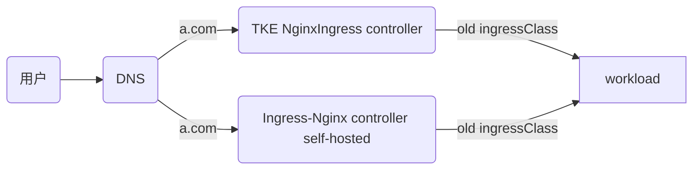

# 方案二：共享 IngressClass 方式

[English Version](./README_en.md)

本方案采用复用原有 IngressClass 的方式，实现新旧控制器共享同一 IngressClass。



### 方案特点
- 复用原有的 IngressClass（如 `test`），新旧控制器共享同一 IngressClass
- 无需修改现有的 Ingress 资源
- 通过权重调整实现流量切换
- 配置相对复杂，需要精确控制

### 适用场景
- 希望最小化配置变更的场景
- 需要渐进式迁移的环境
- 对 Ingress 资源数量较多且不便于逐个修改的情况

### 前提条件
- Kubernetes 版本 >= 1.14 且 <= 1.28


### 第一阶段：环境准备
#### 部署模拟使用TKE NginxIngress组件的线上业务环境：（如已有则可选）
```bash
./install-tke-ingress.sh
```


该脚本将完成：
1. 部署 TKE NginxIngress组件 (默认watch所有命名空间ingress资源)
2. 创建测试应用 (nginx-demo)
3. 配置基于 TKE 组件的 Ingress 规则

#### 部署自建社区Ingress-nginx组件
```bash
./install-community-ingress.sh
```
[Helm 官方仓库](https://kubernetes.github.io/ingress-nginx) 


在该脚本中，会自动配置 [values.yaml](file:///Users/tangtang/Desktop/Go/src/PlayBook-TKE/nginx-ingress->ingress-nginx/values.yaml) 文件来部署新的 Ingress-nginx Controller：

```yaml
controller:
  name: new-controller  # 新的controller工作负载名称

  # 复用旧的ingress class name
  ingressClass: test

  ingressClassResource:
    name: test
    enabled: false  # 不创建新的IngressClass

  # 设置发布服务为旧的服务
  publishService:
    enabled: true
    pathOverride: "kube-system/test-ingress-nginx-controller"  # 旧的service路径

  # 确保服务配置正确
  service:
    type: LoadBalancer
    annotations:
      service.cloud.tencent.com/custom-weight: "100"  # 新controller权重值

# 其他必要的配置
rbac:
  create: true

serviceAccount:
  create: true
  name: nginx-service-account

```


配置说明：
- `controller.name: new-controller` - 新的controller工作负载名称，不能与老的相同
- `ingressClass: test` - 指定 IngressClass 名称为 `test`，与 TKE 组件的 IngressClass 名称相同
- `ingressClassResource.name: test` - IngressClass 资源的名称
- `ingressClassResource.enabled: false` - 禁用IngressClass资源的创建，确保新的 controller 复用现有的 IngressClass
- `publishService.pathOverride: kube-system/test-ingress-nginx-controller` - 设置发布服务为旧的服务路径
- `service.cloud.tencent.com/custom-weight: "100"` - 新controller权重值，将100%流量导向新controller

该脚本将完成：

#### 自建社区Ingress-nginx组件
- 自动安装 Helm 并配置 ingress-nginx 官方仓库
- 检测当前 TKE NginxIngress 的镜像版本
- 根据镜像版本匹配对应的 Helm Chart 版本
- 使用 Helm 部署社区版 ingress-nginx，配置与 TKE NginxIngress 相同的 IngressClass
- 直接使用现有 Ingress 配置，使其同时与新旧 controller 关联
- 验证 Ingress 配置是否正常工作
- 测试新 Ingress 暴露的业务是否可以正常访问
#### 验证新自建ingress-nginx的访问结果
````
2025-08-20 13:11:53
200 0.003802
2025-08-20 13:11:54
200 0.003316
2025-08-20 13:11:55
200 0.003405
2025-08-20 13:11:56
200 0.003368
2025-08-20 13:11:57
200 0.003500
2025-08-20 13:11:58
````

### 第二阶段：平滑迁移
#### 执行平滑迁移
```bash
./migrate.sh
```
该脚本将完成：
- 通过 curl 直接访问新 Ingress 的 IP 地址进行测试，避免修改系统 DNS 配置
- 验证迁移后服务的稳定性和可用性
#### 验证迁移后的访问结果
````
2025-08-20 13:13:41
200 0.003973
2025-08-20 13:13:42
200 0.004360
2025-08-20 13:13:43
200 0.003875
2025-08-20 13:13:44
200 0.003541
2025-08-20 13:13:45
200 0.003257
2025-08-20 13:13:46
200 0.004169
````
## 核心价值
通过自动化脚本实现**零停机迁移**，新旧版本并行运行，避免业务中断，完成从 TKE 组件版到社区版的平滑升级。
